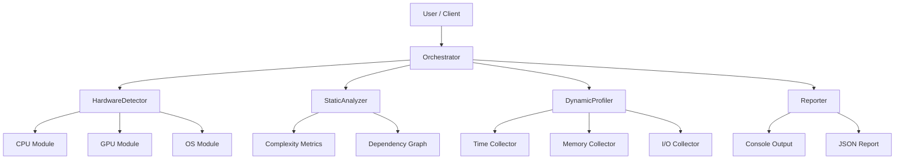

# Omni-Profiler Architecture

## 1. System Design

The system follows a modular architecture to ensure extensibility and testability.

## 2. Components

### 2.1 Orchestrator (`orchestrator.py`)
-   **Responsibility**: Central controller. Receives user request (Function/File/Repo), initializes components, runs the workflow, and aggregates results.
-   **Inputs**: Target (Code/Path), Config.
-   **Outputs**: `ProfileReport` object.

### 2.2 Hardware Detector (`hardware.py`)
-   **Responsibility**: Detects system capabilities at startup.
-   **Key Classes**:
    -   `HardwareInfo`: Data class holding all hardware specs.
    -   `HardwareDetector`: Singleton/Utility to populate `HardwareInfo`.

### 2.3 Static Analyzer (`static/`)
-   **Responsibility**: Analyzes code without execution.
-   **Modules**:
    -   `complexity.py`: Calculates Cyclomatic complexity, Halstead metrics.
    -   `structure.py`: Builds call graphs and import trees.

### 2.4 Dynamic Profiler (`dynamic/`)
-   **Responsibility**: Runs the code and collects runtime metrics.
-   **Strategy**:
    -   Uses `ContextManagers` or `Decorators` to wrap execution.
    -   **TimeCollector**: Wraps `cProfile` or `time.perf_counter`.
    -   **MemoryCollector**: Uses `tracemalloc`.
    -   **IOCollector**: Uses `psutil` counters (snapshot before/after).

### 2.5 Metrics (`metrics/`)
-   **Responsibility**: Defines data structures for metrics.
-   **Classes**: `ProfileMetrics`, `SystemMetrics`, `CodeMetrics`.

## 3. Data Flow

1.  **Initialization**: `Orchestrator` calls `HardwareDetector` to get system context.
2.  **Static Phase**: `Orchestrator` passes target code to `StaticAnalyzer`. Complexity and structure metrics are gathered.
3.  **Dynamic Phase**:
    -   `Orchestrator` sets up `DynamicProfiler`.
    -   Target code is executed within the profiler's context.
    -   Runtime metrics are captured.
4.  **Reporting**: All metrics are merged into a `ProfileReport` and passed to `Reporter` for formatting.

## 4. Extensibility
-   New metrics can be added by creating a new `Collector` class in `dynamic/` or `static/` and registering it with the `Orchestrator`.
-   New hardware support can be added to `HardwareDetector` with appropriate checks.
